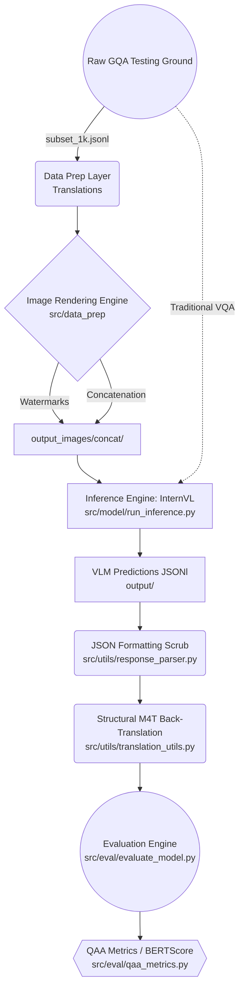

# 📚 VoQA-Multilingual Codebase Walkthrough

This living document maps out every structural pipeline, workflow branch, and scoring calculation built securely into the VoQA repository evaluating Multilingual Vision-Language architectures.

---

## 🏛️ 1. Conceptual Architecture Matrix

The execution strictly follows an uncoupled, sequential module pattern passing physical matrices to subsequent processing layers.



---

## 🗂️ 2. Core Repository Hierarchy & Code Integration

### `src/data_prep/` (Generative Rendering)
* **Takes In:** The raw unedited GQA images and the JSONL translated arrays.
* **Outputs:** Physically encoded images matching Appendix A1/A2 methodologies.
* **Key Files:** 
  - `render_watermarks.py`: Scans pixel luminance locally to enforce dynamically contrasted text overlays.
    ```python
    # Snippet: Adjusting border colors dynamically based on background luminance
    brightness = calculate_luminance(background_patch)
    text_fill = "white" if brightness < 128 else "black"
    border_fill = "black" if brightness < 128 else "white"
    ```
  - `render_concatenation_with_resizing.py`: Produces isolated clean white pads to cleanly append prompt text without obscuring image details.

### `src/model/` (Inference & Prompt Construction)
* **Takes In:** Rendered Image pixels, configured Model Architectures, and Workflow Params.
* **Outputs:** Native Model Inference Arrays into `output/internvl_1b/` predictions.
* **Key Files:**
  - `prompts.py`: Central dictionary containing the exact Zero-Shot text instructions defined by VoQA.
  - `few_shot.py`: The context interleaving engine grabbing dynamic historical subset slices.
    ```python
    # Snippet: Injecting few-shot JSON historical targets inherently to structure the model
    prompt += f"Example {i+1}:\nInput:\n<image>\nOutput:\n{{\"The question in the image\": \"{ex['question']}\", \"Answer\": \"{ex['answer']}\"}}\n"
    ```
  - `ocr_utils.py`: Converts raw box vectors into semantic bounding language.
  - `run_inference.py`: Master inference script looping over the dataset natively.

### `src/utils/` (Modularity Engines)
* **Takes In:** Dirty string outputs from the VLM.
* **Outputs:** Sliced pure strings matching the specific language dictionaries.
* **Key Files:**
  - `response_parser.py`: Employs regex structures to aggressively scrub out unwanted text.
    ```python
    # Snippet: Scraping the VLM string to strictly output dictionary parameters
    json_match = re.search(r'\{.*\}', prediction_string, re.DOTALL)
    ```
  - `translation_utils.py`: Uses SeamlessM4T natively.

### `src/eval/` (Evaluation Engine & QAA Framework)
* **Takes In:** The VLM's generated dictionary predictions.
* **Outputs:** Absolute quantified JSON structures evaluating semantic similarities.
* **Key Files:**
  - `qaa_metrics.py`: Executes edit-distance heuristics identifying watermark parsing success.
    ```python
    # Snippet: QAA isolated metric formula natively derived from VoQA logic
    def calculate_qaa_score(q_hat: str, gt_question: str) -> float:
        distance = calculate_edit_distance(q_hat.lower(), gt_question.lower())
        ratio = distance / float(len(gt_question))
        return max(0.0, 1.0 - ratio) # bounded (0 to 1) QAA metric
    ```
  - `evaluate_model.py`: Automates the final mathematical compilation sequence!
    ```python
    # Snippet: Sorting mathematically the correct/incorrect QAA arrays via BERTScore verification 
    if is_match[i]: 
        qaa_corrects.append(eo["qaa_score"])
    else: 
        qaa_incorrects.append(eo["qaa_score"])
    
    qaa_c = sum(qaa_corrects) / max(1, len(qaa_corrects)) # Averages
    ```

---

## 🧪 3. Exploring the Four Major Workflows

The `run_inference.py` orchestrator supports completely massive architectural switches mapping across four distinct branches. Below lies the expected workflow structures generated.

### Case 1: Traditional VQA
This is exactly how evaluation natively operated before the VoQA paper.
* **Input Structure:** Uses the Raw Untampered image.
* **Instruction String:** Uses `prompt="baseline"`. Passes only the question string natively: `"What color is the car?"`
* **VLM Expected Output:** Highly unpredictable formatting based on VLM training limits. (`"red"` or `"The car is red."`).

### Case 2: No Prompt & Light Prompt Workflow (Zero-shot)
Tests whether the model natively extracts without command enforcement.
* **Input Structure:** Fed the **Watermarked** or **Concatenated** image containing the question physically.
* **Instruction String:**
  * `no_prompt`: Empty string.
  * `light`: `"There is a question in this image, you need to find the question and answer the question based on the visual information of the entire image."`
* **VLM Expected Output:** Relies completely on native unstructured reasoning (`"There is a blue car."`).

### Case 3: Long & Short Workflows *Without* OCR (Zero/Few-Shot Valid)
The primary execution engine forcing strict structural compliance.
* **Input Structure:** Watermark or Concatenated Image.
* **Shots Parameter:** Works for `0-shot` (Zero-shot structure) perfectly, but heavily supports contextual injections scaling across `--shots 2`, `4`, or `8`. 
* **Instruction Template (`short_workflow`):** 
  ```text
  You will receive an image with a watermark question... Output Format (strict JSON):
  { "Detected Question": "...", "Answer": "...", "Reasoning": "..." }
  ```
* **VLM Target Explicit Execution:** 
  ```json
  {"Detected Question": "Di che colore è la macchina?", "Answer": "rosso", "Reasoning": "L'auto è al centro ed è rossa."}
  ```

### Case 4: Long/Short Workflows + GOT-OCR Box Integration
Used structurally as a strict Zero-Shot ablation loop heavily proving context awareness bounds.
* **Input Structure:** Adds dynamically inserted mapping coordinates via the `--use_ocr` param triggering `scr/model/ocr_utils.py`.
* **Instruction Edit:** Modifies the template dynamically inserting absolute layout constraints organically: `"The question is located at bounding box [45, 120, 300, 250] in a 448x448 image."`
* **VLM Output:** JSON Structured similar to Case 3.

---

## 💻 4. Complete Execution Cheatsheet

### 1. Execute Rendering Setup (Watermarking)
```bash
python src/data_prep/render_watermarks.py
```

### 2. Execute VLM Inference Framework 
*(Runs InternVL mapping Italian subset natively on Strict Short Form logic under Zero-shot formatting)*
```bash
python src/model/run_inference.py --model internvl_1b --lang ita --dataset gqa --prompt_type short_workflow --shots 0
```
>*Intermediate outputs log locally in: `output/internvl_1b/gqa/ita/results_short_workflow_0shot.jsonl`*

### 3. Execute Master Evaluation Processing Matrix
```bash
python src/eval/evaluate_model.py --dataset gqa --model internvl_1b 
```
>*The definitive metrics matrix populates fully inside: `output/internvl_1b/gqa/evaluation_results.json`*

---

## 📊 5. The Scale Variable Workload Calculus 

Because the codebase runs deeply iterative permutations inherently mapping logic boundaries mathematically: 

**Base Calculation (1 Language):**
* Traditional VQA Baseline (1)
* Zero-Shot Rendered Unstructured Iterations (3 Layouts * 2 Prompts) = 6
* Strict Generation Zero & Few-shot Iterations (3 Layouts * 2 Prompts * 5 Shots) = 30
* OCR Structural Isolations (3 Layouts * 2 Prompts * 1 Shot) = 6
= **43 Experimental Targets Per Language.**

**Cumulative Mathematical Volume:**
Scaling dynamically across 5 execution targets (`eng`, `ita`, `nld`, `fin`, `spa`):
43 Targets * 5 Languages = **215 Executable Configurations!**

**Time Scale Prediction (For 12.5k Subset):**
Total Operations: `215 * 12,500` = **2,687,500** VLM Array Prompts.
Running at an estimated `0.4 seconds / inference` on H100 GPU blocks dynamically generates ~300 compute hours globally. 
Sliced massively across a `6-GPU Node Block` (e.g. SLURM script `#SBATCH --gres=gpu:6`), the comprehensive matrix completely concludes itself under essentially **~49.7 wall-clock Hours** natively.
