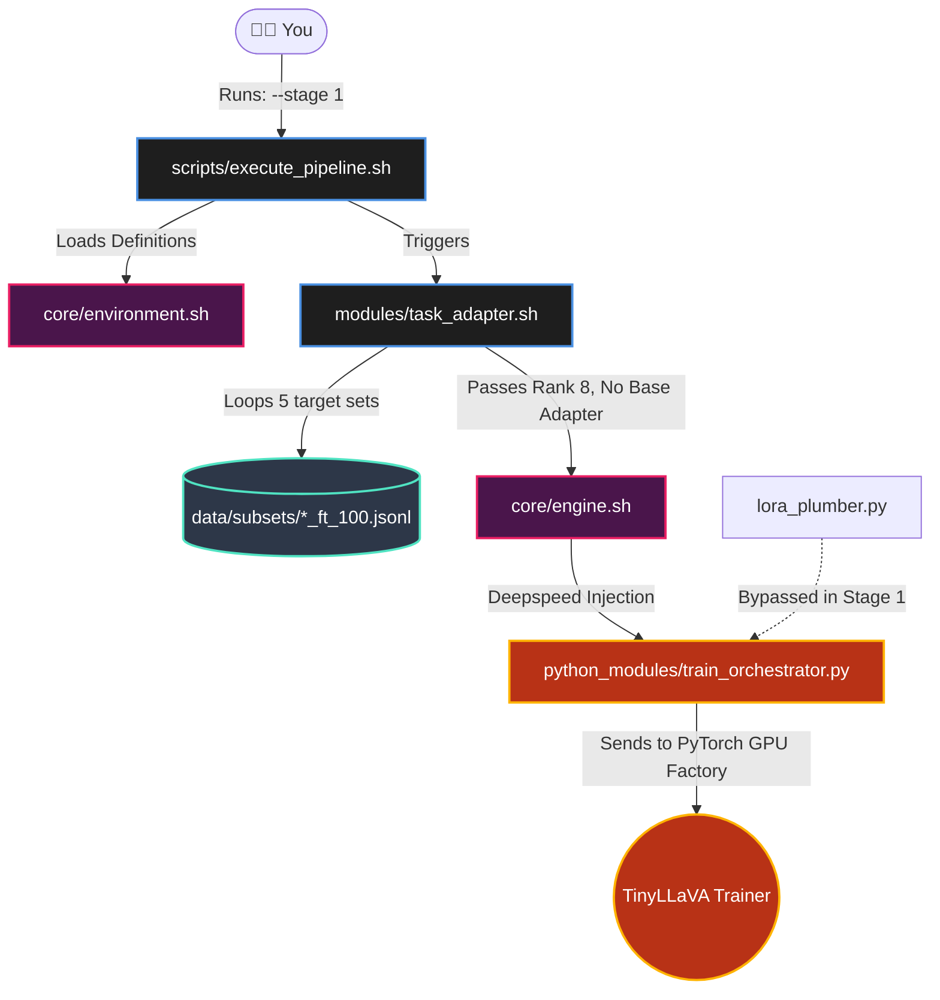
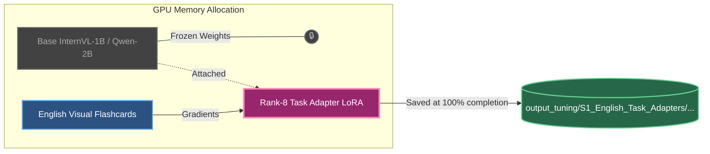

# Stage 1: Zero-Shot English Task Adapters 
### (The Foundational Baking School)

This architecture traces exactly what happens when you type `./execute_pipeline.sh --stage 1`. 

## 1. The Execution Pathway 

Below is the **Execution Trace** showing exactly how the modules communicate and trigger PyTorch natively.



---

## 2. The Neural PyTorch Architecture (Rank-8)

Once the execution flow hits PyTorch, the neural matrix undergoes the following operation dynamically in memory. **Yes, you are exactly right: we use a Rank-8 LoRA block** to memorize complex spatial and visual baking concepts in native English.



## 3. What the Trace proves for the Defense:
- **No Foreign Languages:** The architecture purely hits English JSONL text lines (`EngData`). It cannot be contaminated by translation noise.
- **Rank 8 Capacity:** We prioritize a slightly larger cheat-sheet (Rank 8) here because reasoning across spatial pixels is mathematically heavier than translating syntax.
- **Structural Independence:** The final `Rank-8 Task Adapter LoRA` is structurally saved in maximum isolation into the S1 Vault, ready to become the Frozen anchor for Stage 4.

---

## 4. Text-Based Architecture Drawing (Non-Mermaid)

```text
========================================================================
            STAGE 1: THE UNIFIED "CAT ON THE COUCH" TRAINING LOOP
========================================================================

  [1. RAW INPUT DATA]
  
  [ 📸 cat_couch.jpg ] 
           |                                  [📝 Flashcard]
           v                          "Are there 2 animals on the couch?"
    +-------------+                                   |
    | Vision Tower|                                   |
    | (Eyeballs)  |                                   |
    +-------------+                                   |
           | (Turns picture into math pieces)         |
           +--------------------+---------------------+
                                |
                                V
  [2. THE 24-LAYER FORWARD PASS (PyTorch Factory)]

 +--------------------------------------------------------------------+
 |                       THE 24 FROZEN LAYERS                         |
 |                                                                    |
 |   [Layer 0]                                                        |
 |    🔒 Frozen Q, K, V Attention Matrix                              |
 |    └── 💥 SHOCK HITS HERE -> [Rank-8 LoRA Block 0] (Updates Math)  |
 |                                                                    |
 |                            | (Data flows down)                     |
 |                            v                                       |
 |   [...] (Layers 1 through 22 repeat exactly like this)             |
 |                            |                                       |
 |                            v                                       |
 |   [Layer 23] (The Final Layer)                                     |
 |    🔒 Frozen Q, K, V Attention Matrix                              |
 |    └── 💥 SHOCK HITS HERE -> [Rank-8 LoRA Block 23] (Updates Math)|
 |                                                                    |
 +--------------------------------------------------------------------+
                                | (Prediction: "NO")
                                V
  [3. THE BACKPROPAGATION (The Correction)]
  
                  Target Answer from Flashcard: [ ✅ "YES" ]
                                     |
                                     v
                        [ 💥 PyTorch Calculates: LOSS! ]
                        (AI was 100% wrong, send shock)
                                     |
                                     | (Gradient Signal fires backward)
                                     v
                    (Shocks hit ONLY the LoRA Blocks)

========================================================================

  [4. THE FINAL SYSTEM OUTPUT]
  
  After doing this 100 times for 100 different pictures, the completely 
  trained 24-piece Rank-8 Adapter is saved to your hard drive securely:
  
  💾 -> output_tuning/.../S1_English_Task_Adapters/adapter_model.safetensors
  📊 -> output_tuning/.../S1_English_Task_Adapters/trainer_state.json

========================================================================
```
