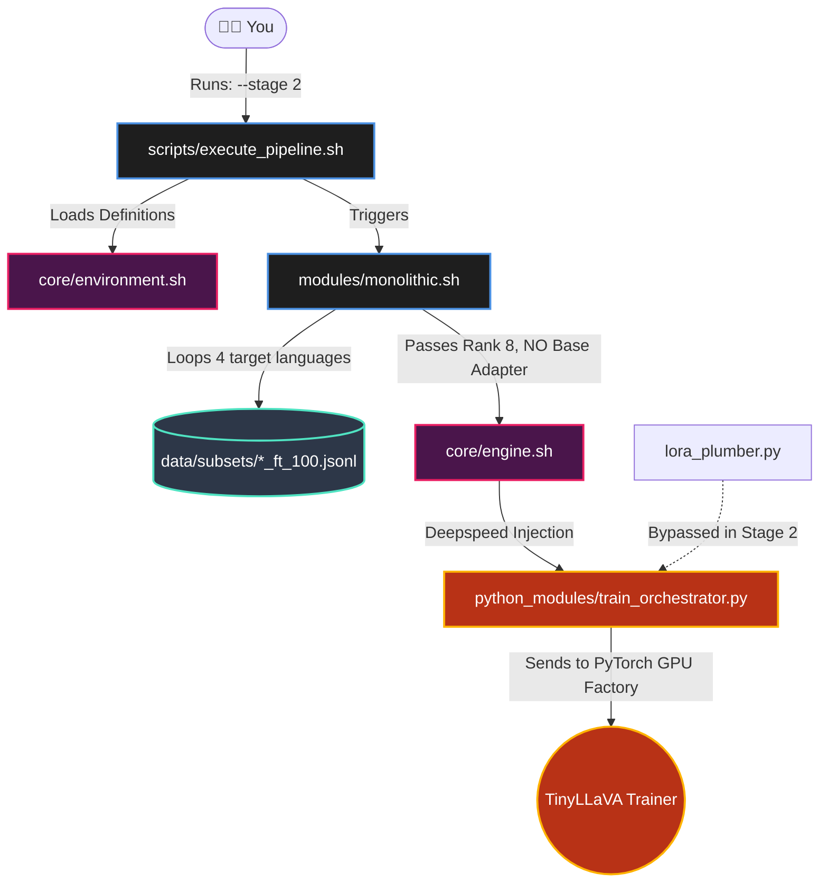
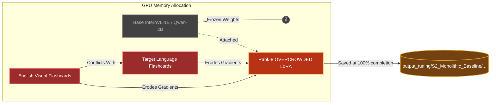

# Stage 2: Monolithic Multilingual Baseline
### (The Lazy Assembly Line)

This architecture traces exactly what happens when you type `./execute_pipeline.sh --stage 2`. This stage is intentionally designed as the "baseline" to prove why our modular Lego stacking is vastly superior.

## 1. The Execution Pathway 

Below is the **Execution Trace** showing exactly how the modules communicate and trigger PyTorch natively.



---

## 2. The Neural PyTorch Architecture (Rank-8)

Once the execution flow hits PyTorch, the neural matrix undergoes the following operation. **Notice that we are forcing BOTH Visual Data and Foreign Language Data into the exact same Rank-8 block.** This causes the visual logic to be overwritten by the language logic!



## 3. What the Trace proves for the Defense:
- **Multilingual Erosion:** Because the visual reasoning math and the Italian translation math are violently trying to update the exact same `Rank-8 LoRA` weights simultaneously, the model experiences Catastrophic Forgetting.
- **No Plumber Intervention:** The [lora_plumber.py](file:///d:/Main/Rnd_Projects/VoQA-Multilingual/src/fine-tuning/python_modules/lora_plumber.py) is bypassed because we are not mathematically stacking Lego blocks here. We are trying (and failing) to do everything in one single block.

---

## 4. Text-Based Architecture Drawing (Non-Mermaid)

```text
========================================================================
       STAGE 2: THE MONOLITHIC "LAZY" TRAINING LOOP (Rank 8 Only)
========================================================================

  [1. RAW OVERCRAMMED DATA]
  
  [ 📸 cat_couch.jpg ] 
           |                        [📝 Italian Translation]
           v                 "Ci sono due animali sul divano?" (Are there 2 animals...)
    +-------------+                                   |
    | Vision Tower|                                   |
    | (Eyeballs)  |                                   |
    +-------------+                                   |
           | (Math pieces)                            |
           +--------------------+---------------------+
                                |
                                V
  [2. THE 24-LAYER FORWARD PASS (The Bottleneck)]

 +--------------------------------------------------------------------+
 |                       THE 24 FROZEN LAYERS                         |
 |                                                                    |
 |   [Layer 0]                                                        |
 |    🔒 Frozen Q, K, V Attention Matrix                              |
 |    └── 💥 SHOCK HITS HERE -> [Rank-8 LoRA Block 0]                 |
 |          (Catastrophic Forgetting: Visual and Language Math Clash) |
 |                                                                    |
 |                            | (Data flows down)                     |
 |                            v                                       |
 |   [...] (Layers 1 through 22 repeat exactly like this)             |
 |                            |                                       |
 |                            v                                       |
 |   [Layer 23] (The Final Layer)                                     |
 |    🔒 Frozen Q, K, V Attention Matrix                              |
 |    └── 💥 SHOCK HITS HERE -> [Rank-8 LoRA Block 23]                |
 |                                                                    |
 +--------------------------------------------------------------------+
                                |
                                V
  [3. THE BACKPROPAGATION (The Erosion)]
  
                  Target Answer: [ ✅ "Sì" (Yes) ]
                                     |
                                     v
                        [ 💥 PyTorch Calculates: LOSS! ]
                                     |
                                     | (Gradient Signal fires)
                                     v
                  (Shocks overwrite the visual math with language math!)

========================================================================

  [4. THE FLAWED SYSTEM OUTPUT]
  
  The final adapter is saved, but its visual reasoning capacity has 
  been severely eroded to make room for Italian grammar rules:
  
  💾 -> output_tuning/.../S2_Monolithic_Baseline/adapter_model.safetensors

========================================================================
```
