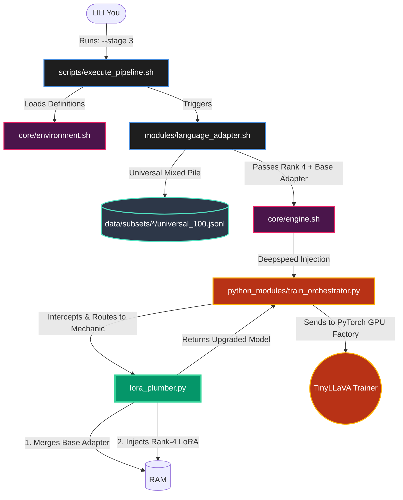
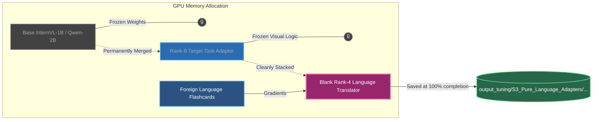

# Stage 3: Pure Modularity (4 Translators + 8 Task Adapters)
### (The "Generalist" Assembly Line)

This architecture traces exactly what happens when you type `./execute_pipeline.sh --stage 3`. This introduces the **LoRA-LEGO Multi-PEFT Stacking**, proving how we isolate visual reasoning from language translation.

## 1. The Execution Pathway 

Below is the **Execution Trace** showing exactly how the orchestrator finally calls the Plumber [lora_plumber.py](file:///d:/Main/Rnd_Projects/VoQA-Multilingual/src/fine-tuning/python_modules/lora_plumber.py).



---

## 2. The Neural PyTorch Architecture (Rank-4)

Once [lora_plumber.py](file:///d:/Main/Rnd_Projects/VoQA-Multilingual/src/fine-tuning/python_modules/lora_plumber.py) prepares the model, the neural matrix looks like this. **Notice that the Base Brain and the Rank-8 Task Adapter are totally frozen.** The visual math is perfectly safe, and ONLY the Italian logic updates the tiny Rank-4 Translator block.



## 3. What the Trace proves for the Defense:
- **No Catastrophic Forgetting:** Beacuse [lora_plumber.py](file:///d:/Main/Rnd_Projects/VoQA-Multilingual/src/fine-tuning/python_modules/lora_plumber.py) merges and freezes the Rank-8 Task Adapter, the Italian translation flashcards are physically blocked from altering the visual reasoning math.
- **Extreme Parameter Efficiency:** Translating syntax is vastly easier than mathematical reasoning. We correctly drop down to an ultra-compact **Rank 4** for the Translator module.
- **Universal Stacking:** This builds 4 generalist modules. It proves that one Italian Translator can successfully bridge across multiple different Datasets.

---

## 4. Text-Based Architecture Drawing (Non-Mermaid)

```text
========================================================================
            STAGE 3: THE UNIVERSAL "PEFT-LEGO" TRAINING LOOP
========================================================================

  [1. RAW TARGET DATA]
  
  [ 📸 cat_couch.jpg ] 
           |                        [📝 Italian Translation]
           v                 "Ci sono due animali sul divano?"
    +-------------+                                   |
    | Vision Tower|                                   |
    | (Eyeballs)  |                                   |
    +-------------+                                   |
           | (Math pieces)                            |
           +--------------------+---------------------+
                                |
                                V
  [2. THE 24-LAYER FORWARD PASS (The "Lego" Stack)]

 +--------------------------------------------------------------------+
 |                       THE 24 FROZEN LAYERS                         |
 |                                                                    |
 |   [Layer 0]                                                        |
 |    🔒 Frozen Q, K, V Attention Matrix                              |
 |    🔒 [Frozen Base Rank-8 Task Adapter] (Knows how to bake)        |
 |    └── 💥 SHOCK HITS HERE -> [Rank-4 Translator Block 0]           |
 |                                                                    |
 |                            | (Data flows down)                     |
 |                            v                                       |
 |   [...] (Layers 1 through 22 repeat exactly like this)             |
 |                            |                                       |
 |                            v                                       |
 |   [Layer 23] (The Final Layer)                                     |
 |    🔒 Frozen Q, K, V Attention Matrix                              |
 |    🔒 [Frozen Base Rank-8 Task Adapter]                            |
 |    └── 💥 SHOCK HITS HERE -> [Rank-4 Translator Block 23]          |
 |                                                                    |
 +--------------------------------------------------------------------+
                                |
                                V
  [3. THE BACKPROPAGATION (The Surgical Update)]
  
                  Target Answer: [ ✅ "Sì" (Yes) ]
                                     |
                                     v
                        [ 💥 PyTorch Calculates: LOSS! ]
                                     |
                                     | (Gradient Signal fires)
                                     v
                   (Shocks hit ONLY the tiny Rank-4 Blocks.)
                  (The Baking Manual is locked in a vault, safe!)

========================================================================

  [4. THE PEFT SYSTEM OUTPUT]
  
  The system ejects exactly 4 Universal Language Modulators (Translators)
  that can be plugged into the 8 Baseline English models at inference!
  
  💾 -> output_tuning/.../S3_Pure_Language_Adapters/ita/adapter_model.safetensors

========================================================================
```
