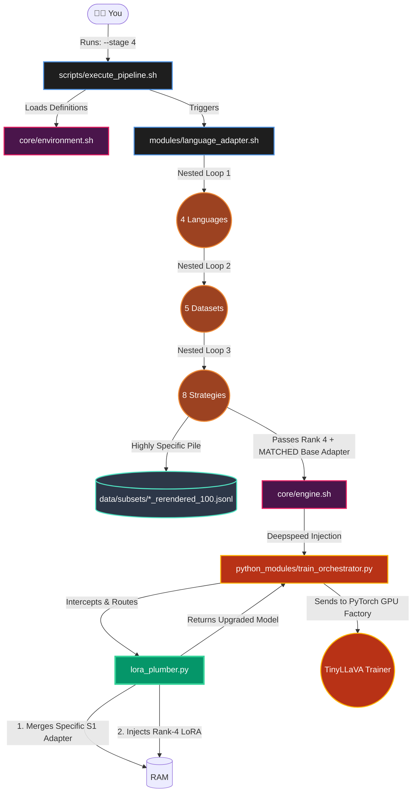
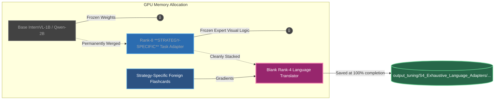

# Stage 4: Exhaustive Modularity (32 Translators + 8 Task Adapters)
### (The "Specialist" Assembly Line)

This architecture traces exactly what happens when you type `./execute_pipeline.sh --stage 4`. This is the final and absolute most powerful execution stage of your thesis. It proves maximum mathematical isolation natively.

## 1. The Execution Pathway 

Below is the **Execution Trace** showing the deep nested loops executed by the Assembly Line Manager.



---

## 2. The Neural PyTorch Architecture (Rank-4)

The memory architecture mathematically looks identical to Stage 3. However, instead of one generalist adapter, there are **32 completely unique, perfectly matched pairs**.



## 3. What the Trace proves for the Defense:
- **Maximum Modularity:** This demonstrates the absolute peak of the Lego-PEFT paradigm. You dynamically match 8 different visual baking manuals perfectly down to 4 different language dictionaries. 
- **Highest Accuracy Yield:** Because the Italian dictionary is only trained on GQA visual reasoning rules, it doesn't get confused by ScienceQA logic, producing the highest native accuracy score mathematically possible.

---

## 4. Text-Based Architecture Drawing (Non-Mermaid)

```text
========================================================================
       STAGE 4: THE SPECIALIZED "PEFT-LEGO" TRAINING LOOP
========================================================================

  [1. THE HIGHLY SPECIFIC INPUT DATA]
  
  [ 📸 GQA Spatial Image ] 
           |                        [📝 Italian Translation]
           v                 "Ci sono due animali sul divano?"
    +-------------+                                   |
    | Vision Tower|                                   |
    | (Eyeballs)  |                                   |
    +-------------+                                   |
           | (Math pieces)                            |
           +--------------------+---------------------+
                                |
                                V
  [2. THE 24-LAYER FORWARD PASS (The "Lego" Stack)]

 +--------------------------------------------------------------------+
 |                       THE 24 FROZEN LAYERS                         |
 |                                                                    |
 |   [Layer 0]                                                        |
 |    🔒 Frozen Q, K, V Attention Matrix                              |
 |    🔒 [Frozen EXPERT GQA-SFT Rank-8 Task Adapter] (Deep Expert)    |
 |    └── 💥 SHOCK HITS HERE -> [Rank-4 Translator Block 0]           |
 |                                                                    |
 |                            | (Data flows down)                     |
 |                            v                                       |
 |   [...] (Layers 1 through 22 repeat exactly like this)             |
 |                            |                                       |
 |                            v                                       |
 |   [Layer 23] (The Final Layer)                                     |
 |    🔒 Frozen Q, K, V Attention Matrix                              |
 |    🔒 [Frozen EXPERT GQA-SFT Rank-8 Task Adapter]                  |
 |    └── 💥 SHOCK HITS HERE -> [Rank-4 Translator Block 23]          |
 |                                                                    |
 +--------------------------------------------------------------------+
                                |
                                V
  [3. THE BACKPROPAGATION (The Surgical Update)]
  
                  Target Answer: [ ✅ "Sì" (Yes) ]
                                     |
                                     v
                        [ 💥 PyTorch Calculates: LOSS! ]
                                     |
                                     | (Gradient Signal fires)
                                     v
                   (Shocks hit ONLY the tiny Rank-4 Blocks.)
            (The Expert Baking Manual is totally locked down & safe!)

========================================================================

  [4. THE PERFECT SYSTEM OUTPUT]
  
  Because of the loops, the system mathematically cycles this process 
  hundreds of times, officially popping out 32 Mastermind Adapters:
  
  💾 -> output_tuning/.../S4_Exhaustive/ita/gqa/qa_sft/adapter_model.safetensors

========================================================================
```
